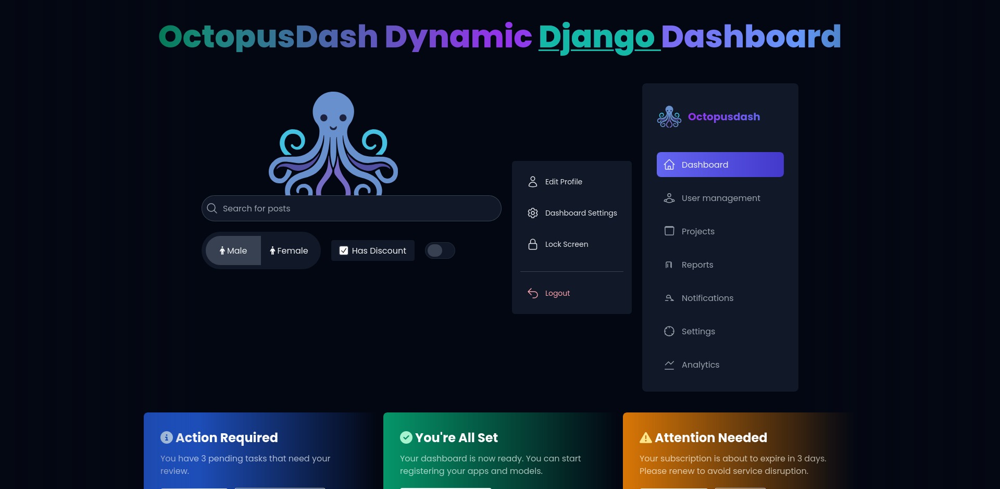
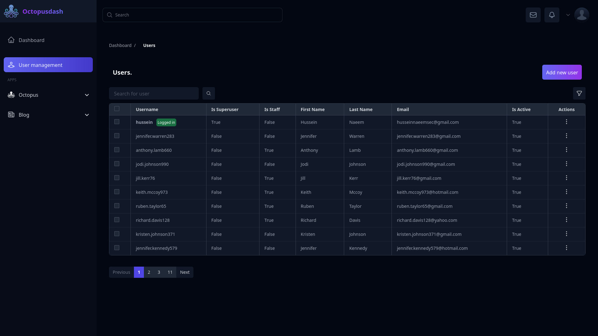

# OctopusDash

⚠️ **IMPORTANT WARNING** ⚠️

**THIS PROJECT IS CURRENTLY IN DEVELOPMENT AND NOT READY FOR PRODUCTION USE**


This version of OctopusDash contains incomplete features and may cause serious bugs or errors in your Django application. Please DO NOT install it in production environments or critical projects at this time.

and we recommend that you wait until we realse the stable version of OctopusDash on `main` branch 

**Current Status:**
- Several core features are still under development
- API may change significantly
- Potential stability issues
- Not thoroughly tested in production environments

We recommend:
- Waiting for the official stable release
- Following our GitHub repository for updates
- Testing only in isolated development environments if you wish to explore the features

---

## Screenshots





OctopusDash is a lightweight, modern Django admin panel alternative that provides an enhanced UI/UX experience using TailwindCSS. It offers seamless model management with drag-and-drop capabilities, advanced filtering, and built-in analytics while maintaining simplicity in setup and usage.

## Features

- **Modern UI with TailwindCSS**: Clean, responsive interface with modern design patterns
- **Simple Registration**: One-line model registration with extensive customization options
- **Enhanced Many-to-Many Fields**: Drag-and-drop interface for managing relationships
- **Advanced Search & Filtering**: Custom search functionality with dynamic filters
- **Built-in Analytics**: Website statistics and user activity analysis
- **Secure Access Management**: Built-in middleware for authorization and permission control
- **Lightweight**: Minimal impact on your project's performance
- **Custom Actions**: Enhanced action system with improved UI/UX
- **Custom Pages**: Add and manage custom pages easily
- **Dynamic Widgets**: Add and manage custom widgets to your dashboard
- **Error Handling**: Improved error detection and reporting
- **Permissions**: Robust permission management system

## Comming soon 

- **Dynamic Django Rest API Views**
- **JWT based authentication permssion and authorization**
- **JWT Middleware**


## Installation

clone the repo 

```bash 
git clone https://github.com/husseinnaeemsec/octopus-dash.git
```

```bash
cd octopus-dash
```

We use ```npm``` for tailwindcss to run ```npm run watch``` to watch files for styling 

```bash
npm install && pip install -r requirements.txt
```

run the server 

```bash

python manage.py runserver

```

for now you can access the dashboad for some apps the views are not completed so after you run the server go to 

```http://localhost:8000/<app_name = octopusdash >/<model_name posts >/<view_name [list,create]>/```

the url would be somthing like this 

List Posts
http://localhost:8000/octopusdash/post/list/
Create Posts
http://localhost:8000/octopusdash/post/create/

To register a model in the admin.py 

```python

from octopusdash.registry import dashboard
from myapp.models import MyModel 

dashboard.register(MyModel)

```

then you can see the models you've register in the dashboard sidebar 


## Credits

Created and maintained by Hussein Naeem

