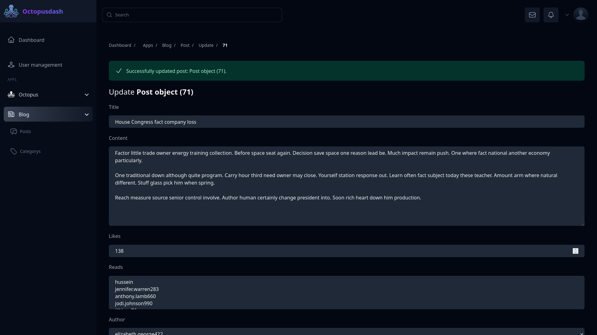
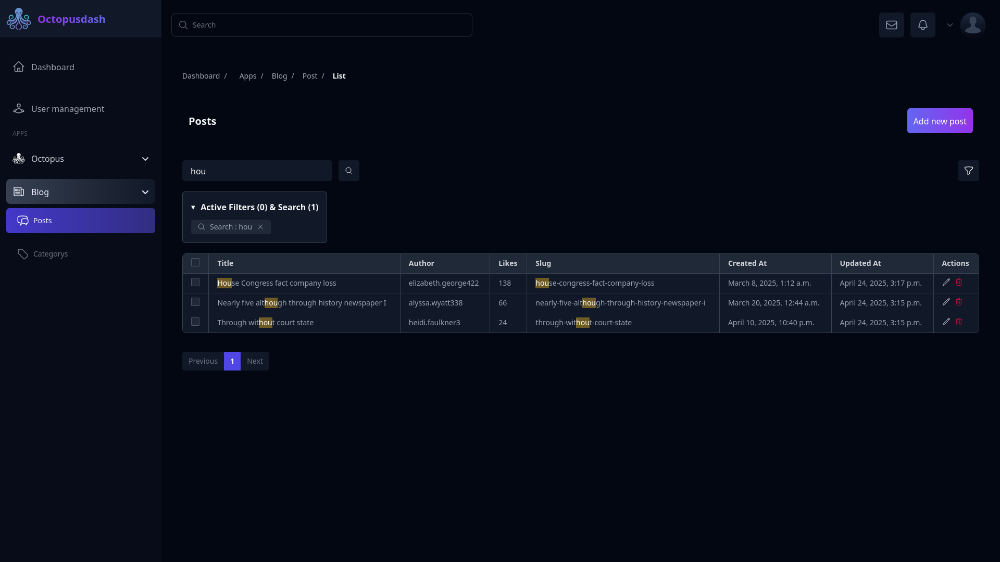
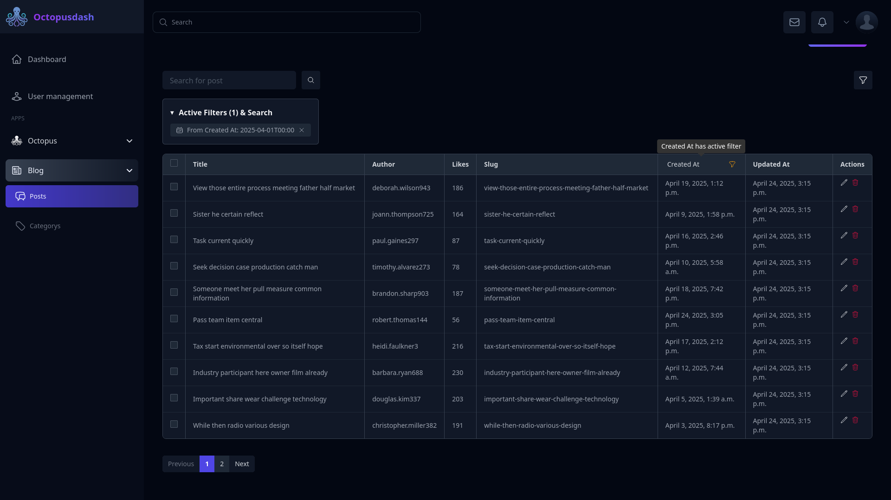

# OctopusDash

⚠️ **IMPORTANT WARNING** ⚠️

**THIS PROJECT IS CURRENTLY IN DEVELOPMENT AND NOT READY FOR PRODUCTION USE**


This version of OctopusDash contains incomplete features and may cause serious bugs or errors in your Django application. Please DO NOT install it in production environments or critical projects at this time.

and we recommend that you wait until we realse the stable version of OctopusDash on `main` branch 

**Current Status:**
- Several core features are still under development
- API may change significantly
- Potential stability issues
- Not thoroughly tested in production environments

We recommend:
- Waiting for the official stable release
- Following our GitHub repository for updates
- Testing only in isolated development environments if you wish to explore the features

---

## Screenshots


User Management

Update instances

Search with highlights

Date filters



OctopusDash is a lightweight, modern Django admin panel alternative that provides an enhanced UI/UX experience using TailwindCSS. It offers seamless model management with drag-and-drop capabilities, advanced filtering, and built-in analytics while maintaining simplicity in setup and usage.

## Features

- **Modern UI with TailwindCSS**: Clean, responsive interface with modern design patterns
- **Simple Registration**: One-line model registration with extensive customization options
- **Enhanced Many-to-Many Fields**: Drag-and-drop interface for managing relationships
- **Advanced Search & Filtering**: Custom search functionality with dynamic filters
- **Built-in Analytics**: Website statistics and user activity analysis
- **Secure Access Management**: Built-in middleware for authorization and permission control
- **Lightweight**: Minimal impact on your project's performance
- **Custom Actions**: Enhanced action system with improved UI/UX
- **Custom Pages**: Add and manage custom pages easily
- **Dynamic Widgets**: Add and manage custom widgets to your dashboard
- **Error Handling**: Improved error detection and reporting
- **Permissions**: Robust permission management system

## Comming soon 

- **Dynamic Django Rest API Views**
- **JWT based authentication permssion and authorization**
- **JWT Middleware**


## Installation

clone the repo 

```bash 
git clone https://github.com/husseinnaeemsec/octopus-dash.git
```

```bash
cd octopus-dash
```

We use ```npm``` for tailwindcss to run ```npm run watch``` to watch files for styling 

```bash
npm install && pip install -r requirements.txt
```

run the server 

```bash

python manage.py runserver

```

Go to http://localhost:port/dashboard/

you'll be redirected to the login page use

`username` = `admin`
`password` = `admin`

## Register models 

```python

from django.contrib import admin
from .models import Post,Category
from octopusdash.admin import dashboard,ODModelAdmin,AppConfiguration


# ============================
# Post Admin Configuration
# ============================
class PostAdmin(ODModelAdmin):
    """
    Custom admin interface for the Post model using OctopusDash.
    Controls how posts are displayed in the admin dashboard.
    """
    list_display = ['title','author','likes','slug','created_at','updated_at']
    
    # SVG icon displayed in OctopusDash sidebar or tab
    icon = ''' 
    <svg xmlns="http://www.w3.org/2000/svg" fill="none" viewBox="0 0 24 24" stroke-width="1.5" stroke="currentColor" class="size-6">
        <path stroke-linecap="round" stroke-linejoin="round" d="M20.25 8.511c.884.284 1.5 1.128 1.5 2.097v4.286c0 1.136-.847 2.1-1.98 2.193-.34.027-.68.052-1.02.072v3.091l-3-3c-1.354 0-2.694-.055-4.02-.163a2.115 2.115 0 0 1-.825-.242m9.345-8.334a2.126 2.126 0 0 0-.476-.095 48.64 48.64 0 0 0-8.048 0c-1.131.094-1.976 1.057-1.976 2.192v4.286c0 .837.46 1.58 1.155 1.951m9.345-8.334V6.637c0-1.621-1.152-3.026-2.76-3.235A48.455 48.455 0 0 0 11.25 3c-2.115 0-4.198.137-6.24.402-1.608.209-2.76 1.614-2.76 3.235v6.226c0 1.621 1.152 3.026 2.76 3.235.577.075 1.157.14 1.74.194V21l4.155-4.155" />
    </svg>
    '''

# Register Post model with custom admin in the dashboard
dashboard.register(Post,PostAdmin)


# ============================
# Category Admin Configuration
# ============================
class CategoryAdmin(ODModelAdmin):
    """
    Custom admin interface for the Category model using OctopusDash.
    """
    list_display = ['name','created_at','updated_at','slug']
    
    # SVG icon used in OctopusDash UI
    icon = '''
    <svg xmlns="http://www.w3.org/2000/svg" fill="none" viewBox="0 0 24 24" stroke-width="1.5" stroke="currentColor" class="size-6">
        <path stroke-linecap="round" stroke-linejoin="round" d="M9.568 3H5.25A2.25 2.25 0 0 0 3 5.25v4.318c0 .597.237 1.17.659 1.591l9.581 9.581c.699.699 1.78.872 2.607.33a18.095 18.095 0 0 0 5.223-5.223c.542-.827.369-1.908-.33-2.607L11.16 3.66A2.25 2.25 0 0 0 9.568 3Z" />
        <path stroke-linecap="round" stroke-linejoin="round" d="M6 6h.008v.008H6V6Z" />
    </svg>
    '''


# Register Category model with dashboard
dashboard.register(Category,CategoryAdmin)


# ============================
# Blog App Configuration
# ============================


class BlogAppConfig(AppConfiguration):
    """
    Sets metadata and icon for the 'blog' app in the OctopusDash UI.
    """
    display_name = 'Blog' # How the app name will be shown in the UI
    
    # SVG icon for the blog app (appears in sidebar or navigation)
    icon = '''
    <svg xmlns="http://www.w3.org/2000/svg" fill="none" viewBox="0 0 24 24" stroke-width="1.5" stroke="currentColor" class="size-6">
        <path stroke-linecap="round" stroke-linejoin="round" d="M12 7.5h1.5m-1.5 3h1.5m-7.5 3h7.5m-7.5 3h7.5m3-9h3.375c.621 0 1.125.504 1.125 1.125V18a2.25 2.25 0 0 1-2.25 2.25M16.5 7.5V18a2.25 2.25 0 0 0 2.25 2.25M16.5 7.5V4.875c0-.621-.504-1.125-1.125-1.125H4.125C3.504 3.75 3 4.254 3 4.875V18a2.25 2.25 0 0 0 2.25 2.25h13.5M6 7.5h3v3H6v-3Z" />
    </svg>
    '''
    
# Register the app config with OctopusDash
dashboard.set_app_config('blog',BlogAppConfig)


````